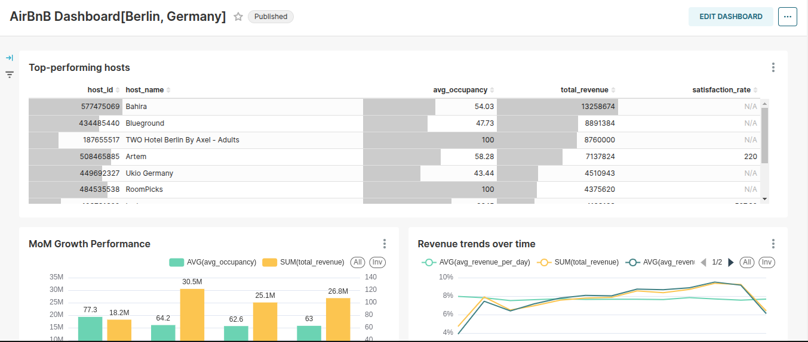
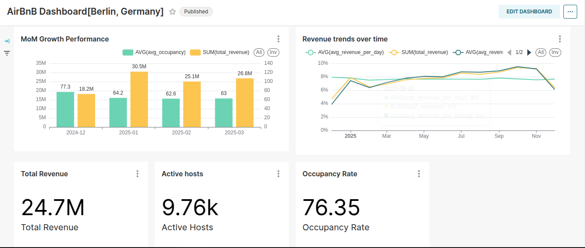

# S3 to PostgreSQL Local Data Warehouse Pipeline

A modern data warehouse solution for small to medium businesses, featuring automated data ingestion from S3/MinIO, transformation using dbt, and analytics dashboards with Apache Superset.




## Architecture

- **Data Lake**: MinIO (S3-compatible)
- **Data Warehouse**: PostgreSQL
- **Transformation**: dbt
- **Analytics**: Apache Superset
- **Infrastructure**: Docker Compose

## Features

- Automated data ingestion from S3/MinIO to PostgreSQL
- Modular dbt transformations with staging, intermediate, and mart layers
- Type 1, 2, and 3 Slowly Changing Dimensions (SCD)
- Real-time data quality monitoring
- Interactive dashboards with Apache Superset
- Comprehensive test coverage
- Docker-based local development environment

## Prerequisites

- Docker and Docker Compose
- Python 3.12+
- Make (optional, for using Makefile commands)

## Quick Start

1. Clone the repository:
```bash
git clone <repository-url>
cd Local-DW
```

2. Create and configure environment files:
```bash
cp dbt/profiles.yml.template dbt/profiles.yml
# Edit profiles.yml with your configurations
```

3. Start the services:
```bash
docker compose up -d
```

4. Initialize Superset:
```bash
./local-superset-setup.sh
```

5. Upload sample data to MinIO:
```bash
python upload_to_minio.py
```

6. Run the data pipeline:
```bash
python -m src.main
```

7. Run dbt transformations:
```bash
cd dbt
dbt deps
dbt run
dbt test
```

## Testing

Run the test suite:
```bash
make test
```

Or manually:
```bash
docker compose -f docker-compose.test.yml up -d
pytest tests/
```

## Project Structure

```
├── dbt/
│   ├── models/
│   │   ├── staging/      # Raw data models
│   │   ├── intermediate/ # Cleaned and standardized models
│   │   └── marts/        # Business-specific models
│   ├── tests/
│   └── analyses/
├── src/
│   ├── pipeline/
│   └── config.py
├── superset/
├── tests/
└── docker-compose.yml
```

## Accessing Services

- **MinIO Console**: http://localhost:9001
- **Superset**: http://localhost:8080 (default credentials: admin/secret)
- **PostgreSQL**: localhost:5432
